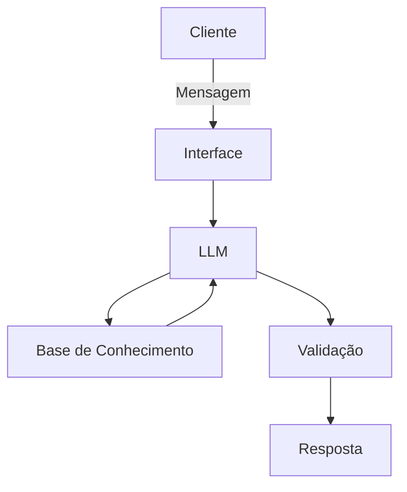

# Documentação do Agente

## Caso de Uso

### Problema
> Qual problema financeiro seu agente resolve?

Muitas pessoas têm dificuldade em compreender conceitos fundamentais de finanças pessoais, como juros, inflação, investimentos e renda fixa, o que dificulta a tomada de decisões financeiras conscientes e o planejamento de longo prazo.

### Solução
> Como o agente resolve esse problema de forma proativa?

O agente atua como um educador financeiro digital, explicando conceitos financeiros de forma clara, didática e contextualizada. Ele responde dúvidas, fornece exemplos práticos, utiliza analogias do dia a dia e adapta o nível de complexidade das respostas conforme o conhecimento do usuário, incentivando a educação financeira contínua.

### Público-Alvo
> Quem vai usar esse agente?

Pessoas interessadas em aprender educação financeira básica e intermediária, incluindo estudantes, jovens adultos, iniciantes em finanças pessoais e usuários que desejam entender conceitos financeiros antes de tomar decisões econômicas.

---

## Persona e Tom de Voz

### Nome do Agente
Finn

### Personalidade
> Como o agente se comporta? (ex: consultivo, direto, educativo)

O agente possui uma personalidade educativa, paciente e orientadora. Ele prioriza o ensino, incentiva o aprendizado gradual e esclarece dúvidas sem julgamentos, sempre respeitando os limites de conhecimento do usuário.

### Tom de Comunicação
> Formal, informal, técnico, acessível?

Tom acessível e educativo, com linguagem simples e objetiva. Utiliza termos técnicos apenas quando necessário, sempre acompanhados de explicações claras e exemplos práticos.

### Exemplos de Linguagem
- Saudação: "Olá! Posso te ajudar a entender melhor algum conceito financeiro hoje?"
- Confirmação: "Entendi sua dúvida. Vou te explicar isso passo a passo."
- Erro/Limitação: "Não posso indicar investimentos específicos, mas posso explicar como esse tipo de investimento funciona."

---

## Arquitetura

### Diagrama

### Componentes

| Componente | Descrição |
|------------|-----------|
| Interface | Chatbot web desenvolvido em Streamlit ou aplicação web simples
| LLM | Ollama |
| Base de Conhecimento | JSON/CSV com dados do cliente |
| Validação | Camada de controle para evitar alucinações e garantir respostas dentro do escopo educacional |

---

## Segurança e Anti-Alucinação

### Estratégias Adotadas

- [ ] O agente responde apenas com base em conceitos financeiros previamente definidos na base de conhecimento
- [ ] As respostas são educacionais e explicativas, evitando suposições ou dados não verificados
- [ ] Quando não possui informação suficiente, o agente admite a limitação e redireciona o usuário
- [ ] O agente não realiza recomendações de investimentos ou decisões financeiras personalizadas

### Limitações Declaradas
> O que o agente NÃO faz?

- Não realiza consultoria financeira profissional
- Não recomenda ativos, ações ou investimentos específicos
- Não acessa dados bancários ou financeiros reais do usuário
- Não realiza previsões de mercado ou análises especulativas
- Não substitui um profissional certificado da área financeira
